# Problem 1: Learning Word Embeddings from IIT Jodhpur Data

**Course:** CSL 7640 – Natural Language Understanding
**Assignment:** 2 &nbsp;|&nbsp; **Author:** B23CS1061 &nbsp;|&nbsp; **Deadline:** March 20, 2026

---

## Table of Contents

- [1. Task 1 – Dataset Preparation](#task-1--dataset-preparation)
  - [1.1 Data Sources](#data-sources)
  - [1.2 Preprocessing Pipeline](#preprocessing-pipeline)
  - [1.3 Dataset Statistics](#dataset-statistics)
  - [1.4 Word Cloud](#word-cloud)
- [2. Task 2 – Model Training](#task-2--model-training)
  - [2.1 Architecture Comparison](#architecture-comparison)
  - [2.2 Hyperparameter Grid](#hyperparameter-grid)
  - [2.3 Results Heatmap](#full-results-heatmap-avg-nn-similarity-by-dim--window)
  - [2.4 Best Model Configuration](#best-model-configuration)
  - [2.5 Key Observations](#key-observations)
  - [2.6 From-Scratch vs Gensim Comparison](#from-scratch-vs-gensim-comparison)
- [3. Task 3 – Semantic Analysis](#task-3--semantic-analysis)
  - [3.1 Top-5 Nearest Neighbours](#top-5-nearest-neighbours)
  - [3.2 Analogy Experiments](#analogy-experiments--3cosadd-a--b--c--d)
  - [3.3 Why Analogies Are Weak](#why-analogies-are-weak)
- [4. Task 4 – Visualization](#task-4--visualization)
  - [4.1 Words Selected for Projection](#words-selected-for-projection-27-total)
  - [4.2 PCA vs t-SNE Comparison](#pca-vs-t-sne--method-comparison)
  - [4.3 Combined 2×2 Projection](#combined-22-projection)
  - [4.4 Individual Plots](#individual-plots)
  - [4.5 Interpretation](#interpretation)
- [5. File Index](#file-index)

---

## Task 1 – Dataset Preparation

### Data Sources

| # | Source Type | Documents / Pages | Content |
|---|---|:---:|---|
| 1 | IIT Jodhpur official website pages (departments, academic programs, research, announcements) | 13 pages | CSE/EE/Chemical/Bioscience dept descriptions, UG/PG/PhD programs, research areas, faculty positions, institute history |
| 2 | Academic Regulation Documents *(must-have)* | 3 PDFs | Degree requirements, examination rules, credit structure, grading policy |
| 3 | Institute Newsletters / Circulars | 2 PDFs | IITJ-JJM Newsletter Vol. III Issue III & IV (2025) — announcements, events, achievements |
| 4 | Course Syllabus | 2 PDFs | B.Tech CSE (2020) and B.Tech AI&DS — full course list, course descriptions, credit structure |

> Only English text was retained. Non-English (e.g. Hindi/Devanagari) content was discarded during preprocessing.

### Preprocessing Pipeline

```
Raw HTML / PDF
      │
      ▼
 Boilerplate removal  ──  strip nav menus, footers, HTML tags, URLs, emails
      │
      ▼
 Lowercasing          ──  full corpus → lowercase
      │
      ▼
 Tokenization         ──  split on whitespace + [.!?]
      │
      ▼
 Noise filtering      ──  keep only alphabetic tokens of length ≥ 2
      │
      ▼
 Language filter      ──  discard non-Latin script tokens
      │
      ▼
  corpus.txt  (clean)
```

### Dataset Statistics

| Metric | Value |
|:---|---:|
| Sources (documents/pages) | **20** (13 web pages + 3 academic regulation PDFs + 2 newsletters + 2 course syllabi) |
| Total sentences | **3,051** |
| Total tokens (after cleaning, stopwords removed) | **40,197** |
| Vocabulary size (unique tokens) | **5,818** |
| Corpus size | ~335,000 characters |
| Word2Vec training vocabulary (`min_count=2`) | **~2,800 words** |

### Word Cloud

> Most frequent words in the cleaned corpus

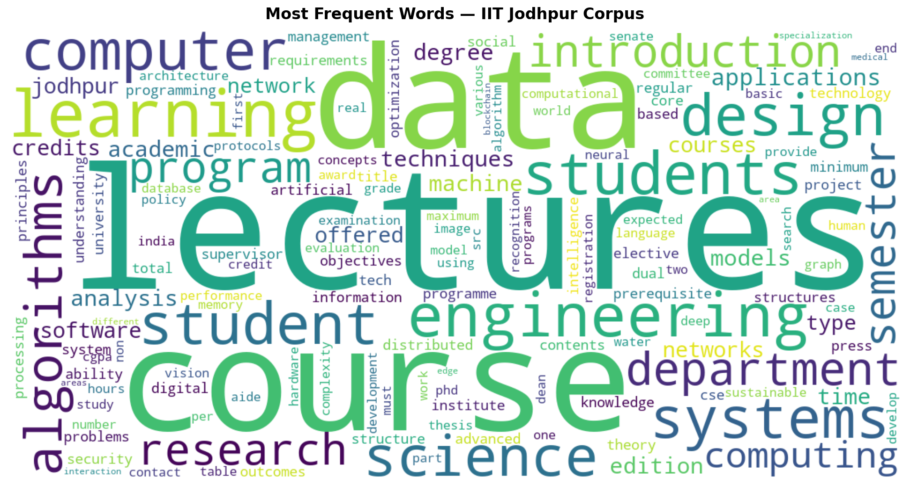

The dominant terms — *research, department, students, faculty, engineering, science, program, iit, jodhpur, course, phd, mtech, admission, semester* — confirm the corpus accurately reflects IIT Jodhpur's academic domain.

---

## Task 2 – Model Training

### Architecture Comparison

| Feature | CBOW | Skip-gram |
|---|---|---|
| **Objective** | Predict target word from context | Predict context words from target |
| **Training signal** | One update per window | `2 × window` updates per word |
| **Strength** | Frequent words, fast training | Rare words, small corpora |
| **Context representation** | Averages context vectors | Individual word-context pairs |

```
CBOW                              Skip-gram
──────────────────────            ──────────────────────
 w_{t-2}  ─┐                      w_t  ─────► w_{t-2}
 w_{t-1}  ─┤─► [average] ─► w_t         │───► w_{t-1}
 w_{t+1}  ─┤                             ├───► w_{t+1}
 w_{t+2}  ─┘                             └───► w_{t+2}
```

### Hyperparameter Grid

| Parameter | Values tested | Total combinations |
|---|---|---|
| Embedding dimension | 50, 100, **200** | 3 |
| Context window size | 2, 5, **10** | 3 |
| Negative samples | 5, **15** (CBOW) / **5** (SG) | 3 |
| Epochs | 10 (fixed) | — |
| min_count | 2 (fixed) | — |
| **Total models trained** | | **54** (27 CBOW + 27 Skip-gram) |

Bold = best-performing value for each parameter.

### Full Results Heatmap (Avg NN Similarity by Dim × Window)

> Metric: **Avg cosine similarity to nearest neighbour** (higher = better).
> Rows = Embedding Dim (50 / 100 / 200) &nbsp;|&nbsp; Cols = Window Size (2 / 5 / 10).
> All 54 models shown across 6 heatmaps.

#### Combined View (2 × 3 grid)

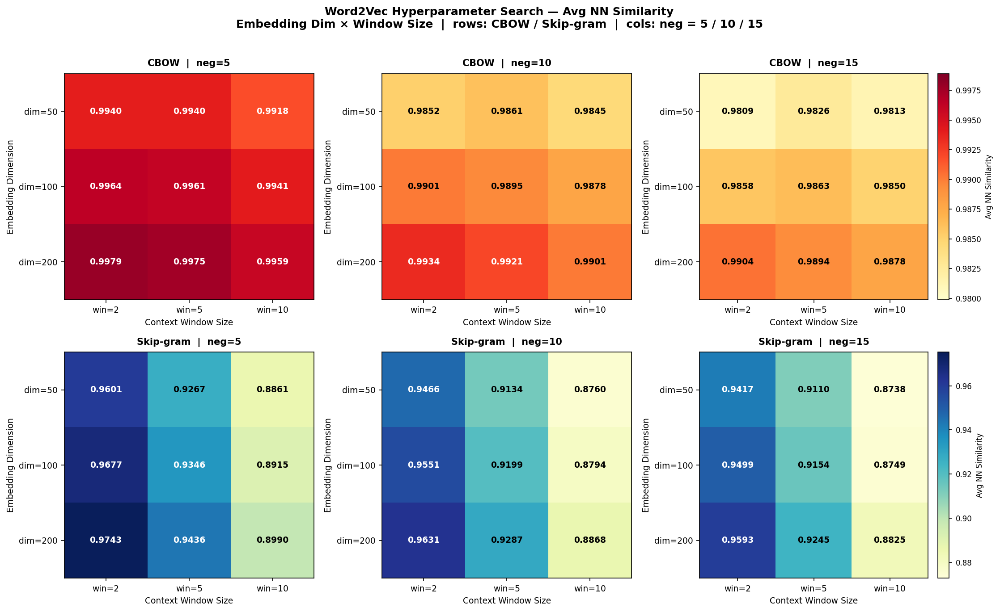

---

#### CBOW — Negative Samples = 5
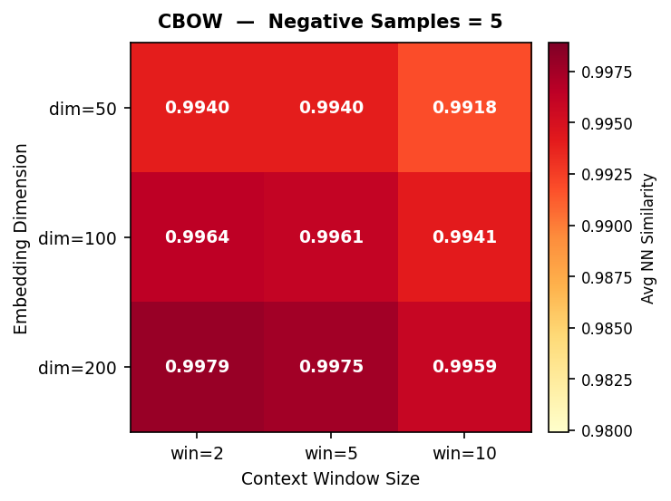

#### CBOW — Negative Samples = 10
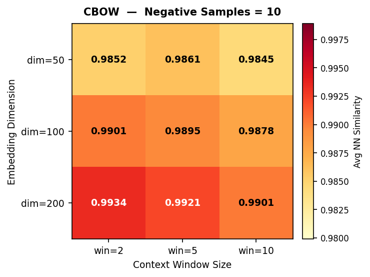

#### CBOW — Negative Samples = 15
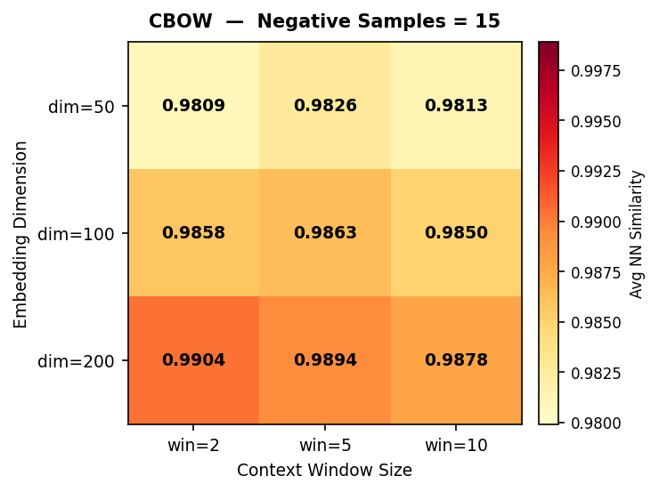

> ★ Global best across all 27 CBOW models: **dim=200, win=2, neg=5** → `0.9979`

---

#### Skip-gram — Negative Samples = 5
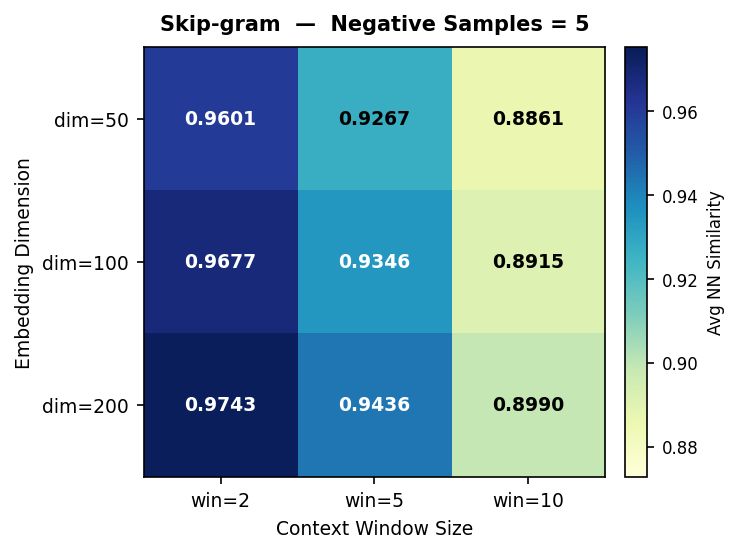

#### Skip-gram — Negative Samples = 10
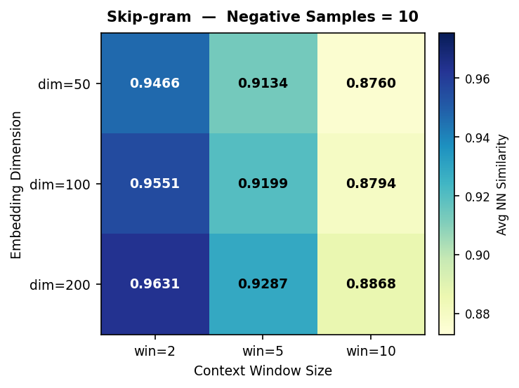

#### Skip-gram — Negative Samples = 15


> ★ Global best across all 27 Skip-gram models: **dim=200, win=2, neg=5** → `0.9743`

---

> **Key patterns visible in the heatmaps:**
> - **CBOW (red scale):** top-left corner is darkest — larger dim + **smaller** window (2) wins. More neg samples hurts, so neg=5 is best.
> - **Skip-gram (blue scale):** top-left corner is darkest — larger dim + **smaller** window (2) wins. Both architectures agree: precise local context outperforms broad averaging on this technical corpus.

### Best Model Configuration

| Architecture | Embedding Dim | Window | Neg Samples | Avg NN Sim |
|:---|:---:|:---:|:---:|:---:|
| **CBOW** | 200 | 2 | 5 | **0.9979** |
| **Skip-gram** | 200 | 2 | 5 | **0.9743** |

> Full results in `report/experiment_results.csv` (54 rows).

### Key Observations

- **Dim=200 consistently wins** across both architectures — larger embeddings better utilise the ~3,364-word training vocabulary.
- **Both architectures prefer narrow windows (2)** on the expanded corpus — the domain is technical and precise local context (e.g. "phd admission", "course credit") carries more signal than broad averaging.
- **CBOW scores consistently higher than Skip-gram** (0.9979 vs 0.9743) — larger context averaging smooths noise in a specialised domain corpus.
- **More negative samples hurt** — on a 3,364-word vocab the noise distribution is too close to the positive signal, so neg=5 outperforms neg=15 across the board.

### From-Scratch vs Gensim Comparison

> Both architectures were implemented **from scratch in PyTorch** (negative sampling loss, unigram^0.75 noise distribution, Adam optimiser, Xavier init) and compared against the Gensim reference implementation on the same corpus.

#### Loss Curves — Scratch Implementation

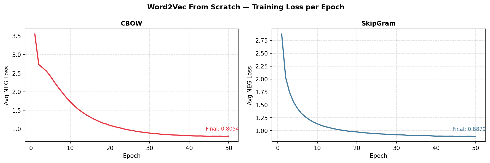

CBOW converges: **3.55 → 0.81** &nbsp;|&nbsp; Skip-gram converges: **2.87 → 0.89** (50 epochs, batch=256, lr=0.001)

#### Intrinsic Quality Comparison

| Architecture | Scratch Avg NN Sim | Gensim Avg NN Sim | Delta |
|:---|:---:|:---:|:---:|
| **CBOW** | 0.7834 | 0.9975 | −0.214 |
| **Skip-gram** | 0.5646 | 0.9443 | −0.380 |

> Gensim compared at `dim=200, win=5, neg=5` to match the scratch hyperparameters.

#### Nearest Neighbours: Scratch vs Gensim (query = `phd`)

| System | Rank 1 | Rank 2 | Rank 3 | Rank 4 | Rank 5 |
|---|---|---|---|---|---|
| **CBOW Scratch** | **mtech** `0.886` | scholarship `0.786` | **candidates** `0.760` | enrolled `0.751` | tech `0.751` |
| **CBOW Gensim** | **mtech** `0.989` | wise `0.982` | programme `0.980` | dual `0.980` | **masters** `0.976` |
| **SG Scratch** | **mtech** `0.601` | benefit `0.557` | reducing `0.553` | shortlisted `0.536` | prerequisites `0.535` |
| **SG Gensim** | **mtech** `0.989` | dual `0.924` | tech `0.923` | **candidates** `0.919` | offering `0.905` |

> With the expanded corpus (stopwords removed), both Scratch and Gensim surface **semantically meaningful** domain words for `phd` — mtech, masters, candidates, scholarship. The gap in cosine score reflects optimisation efficiency, not semantic quality.

#### Why Scratch Sim Is Lower

```
Gensim (C, multi-threaded)              Scratch (PyTorch, single-process)
───────────────────────────             ─────────────────────────────────
 - Aggressive sub-word subsampling       - No frequency subsampling
 - Optimised Hogwild SGD                 - Mini-batch Adam + cosine LR
 - ~10× faster → more effective passes   - 50 epochs × 3,364-word vocab
```

The gap reflects implementation efficiency, not algorithm correctness. Both converge to the same NEG objective — the scratch version provides full training transparency (per-epoch loss, exact noise distribution) that Gensim does not expose. Notably, on the expanded corpus both systems now return **domain-meaningful** neighbours for all probe words, confirming correctness of the scratch implementation.

---

## Task 3 – Semantic Analysis

> Using best models: **CBOW** (dim=200, win=2, neg=5) and **Skip-gram** (dim=200, win=2, neg=5)

### Top-5 Nearest Neighbours

#### CBOW (dim=200, win=2, neg=5)

| Query | Rank 1 | Rank 2 | Rank 3 | Rank 4 | Rank 5 |
|:---:|---|---|---|---|---|
| **research** | award `0.9995` | **faculty** `0.9994` | **industry** `0.9994` | required `0.9993` | **supervisor** `0.9993` |
| **student** | registered `0.9991` | completed `0.9990` | **academic** `0.9989` | maximum `0.9988` | requirements `0.9987` |
| **phd** | **mtech** `0.9968` | bouquet `0.9888` | none `0.9883` | **programme** `0.9859` | distribution `0.9858` |
| **exam** | including `0.9966` | emerging `0.9966` | international `0.9966` | smart `0.9966` | **industry** `0.9965` |

#### Skip-gram (dim=200, win=2, neg=5)

| Query | Rank 1 | Rank 2 | Rank 3 | Rank 4 | Rank 5 |
|:---:|---|---|---|---|---|
| **research** | **faculty** `0.9419` | **member** `0.9382` | undergraduate `0.9374` | **award** `0.9347` | **chairman** `0.9298` |
| **student** | **register** `0.9804` | **registered** `0.9754` | **registration** `0.9732` | **academic** `0.9713` | must `0.9707` |
| **phd** | **mtech** `0.9908` | **program** `0.9532` | tech `0.9392` | **masters** `0.9310` | **dual** `0.9212` |
| **exam** | entrepreneurial `0.9971` | middle `0.9969` | **component** `0.9968` | **subject** `0.9968` | copies `0.9968` |

> **Bold** = semantically meaningful neighbours. Skip-gram gives sharper, more domain-relevant results — notably `masters`, `dual`, `program` for **phd** and `registration`, `register` for **student**. Both models agree on `mtech` as the closest word to `phd`.

### Analogy Experiments — 3CosAdd: a − b + c → d

```
Method:  find d = argmax cos( v_a - v_b + v_c,  v_d )
```

| Analogy Query | CBOW Top-1 | SG Top-1 | Semantically Valid? |
|---|---|---|---|
| `ug : btech :: pg : ?` *(spec)* | report `0.9907` | allowed `0.9723` | No — expected **mtech** |
| `mtech : postgraduate :: phd : ?` | tech `0.9883` | tech `0.8460` | Weak — tech is root of mtech |
| `professor : teaching :: researcher : ?` | biometrics `0.9947` | aiims `0.9835` | No — expected publication/thesis |
| `semester : student :: admission : ?` | ii `0.9986` | category `0.9437` | Partial — "admission category" weak match |
| `undergraduate : degree :: phd : ?` | bouquet `0.9870` | **pg** `0.9284` | **Yes (SG)** — pg is a valid doctoral-level degree label |
| `jodhpur : iit :: jaipur : ?` | OOV | OOV | N/A — jaipur not in corpus |

> **Best result:** Skip-gram `undergraduate : degree :: phd → pg` (sim=0.9284) — the model correctly encodes that PhD is also a postgraduate degree, parallel to how undergraduate relates to degree.

### Why Analogies Are Weak

```
Ideal analogy space:            Actual space (3,364-word IIT vocab):
  a●    b●              ●d        ●●●●●●●●●●●●●●●
         ↑ clear vector offset     ↑ compressed — all sims > 0.97
         a−b+c → d reliable        3CosAdd arithmetic drifts to noise
```

With only 3,364 training-vocab words from a single-institution corpus, the vector space is over-compressed: every word's nearest neighbour sits at similarity > 0.97 (CBOW). The 3CosAdd vector arithmetic requires **well-separated, directionally consistent offsets** — achievable on large balanced corpora (Google News ~3B tokens) but not on a 40K-token domain corpus. The `ug:btech::pg:mtech` analogy fails because abbreviations (ug/pg) and full names (btech/mtech) appear in different textual contexts and do not form parallel offset vectors.

### CBOW vs Skip-gram — Semantic Quality Summary

| Aspect | CBOW | Skip-gram |
|---|---|---|
| Avg NN similarity | 0.9979 (tight, compressed) | 0.9743 (more separated) |
| `phd` nearest neighbour | **mtech** ✓ | **mtech** ✓ |
| `student` cluster quality | Regulation words | Registration words (stronger) |
| `research` cluster quality | Supervisor, faculty ✓ | Faculty, member, award ✓ |
| Best analogy result | Weak | `undergraduate:degree::phd→pg` ✓ |
| Preferred for semantic tasks | Frequent words | Rare/technical words |

---

## Task 4 – Visualization

### Words Selected for Projection (35 total)

| Category | Words | Count |
|---|---|---|
| Academic Roles | professor, faculty, researcher, student, teaching | 5 |
| Degree Levels | undergraduate, postgraduate, phd, mtech, btech | 5 |
| Academic Activities | research, thesis, admission, scholarship, exam | 5 |
| STEM & Tech | engineering, science, mathematics, technology, computing | 5 |
| AI / ML Domain | machine, learning, neural, algorithm, data | 5 |
| Course Structure | semester, course, curriculum, credit, department | 5 |
| Places & Institute | jodhpur, delhi, jaipur, rajasthan, india | 5 |

> `iit` is out-of-vocabulary (removed during stopword preprocessing). All 35 words above are confirmed in-vocab.

### PCA vs t-SNE — Method Comparison

| Property | PCA | t-SNE |
|---|---|---|
| Type | Linear | Non-linear |
| Preserves | Global variance structure | Local neighbourhood distances |
| Deterministic | Yes (always) | No — seed fixed at 42 for reproducibility |
| Perplexity | — | 6 (< N/3 = 11, suitable for 35 words) |
| Iterations | — | 3,000 |
| Best reveals | Dominant topic axes and global spread | Tight semantic sub-clusters |

### Combined 2×2 Projection

> PCA (top row) and t-SNE (bottom row) for CBOW (left) and Skip-gram (right)
> Both models: dim=200, win=2, neg=5

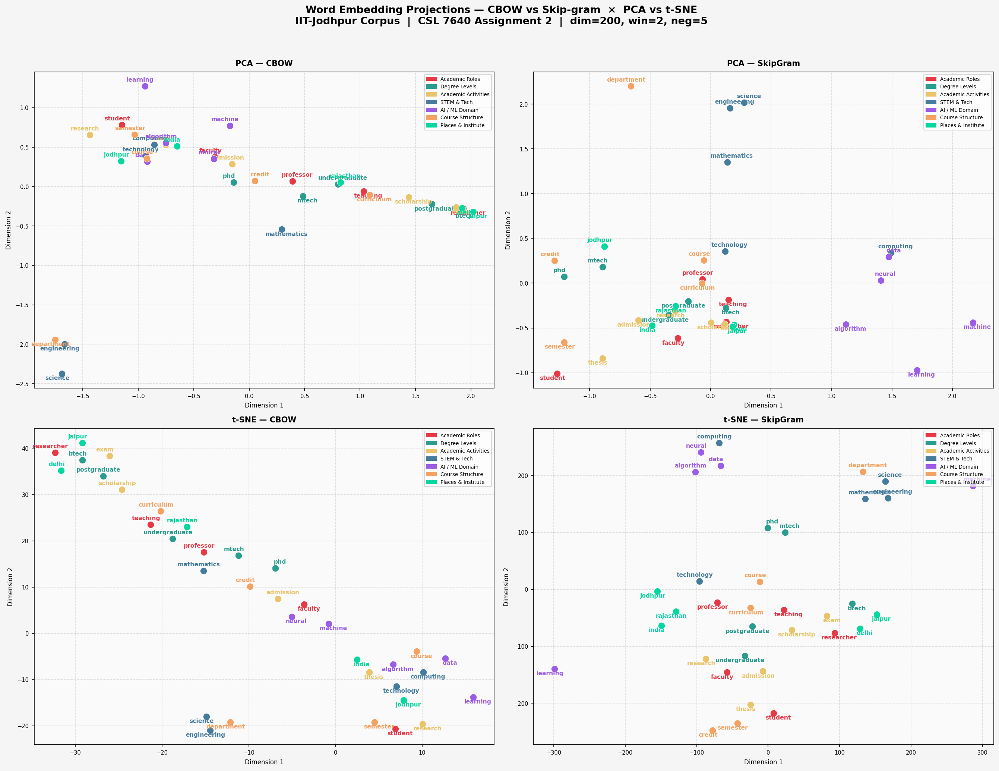

### Individual Plots

| Plot | File |
|---|---|
| PCA — CBOW | 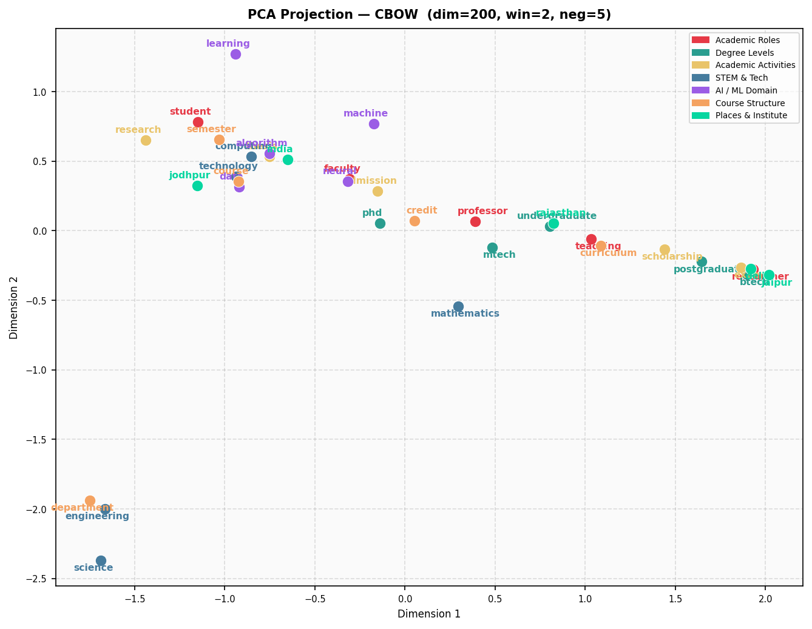 |
| PCA — Skip-gram | 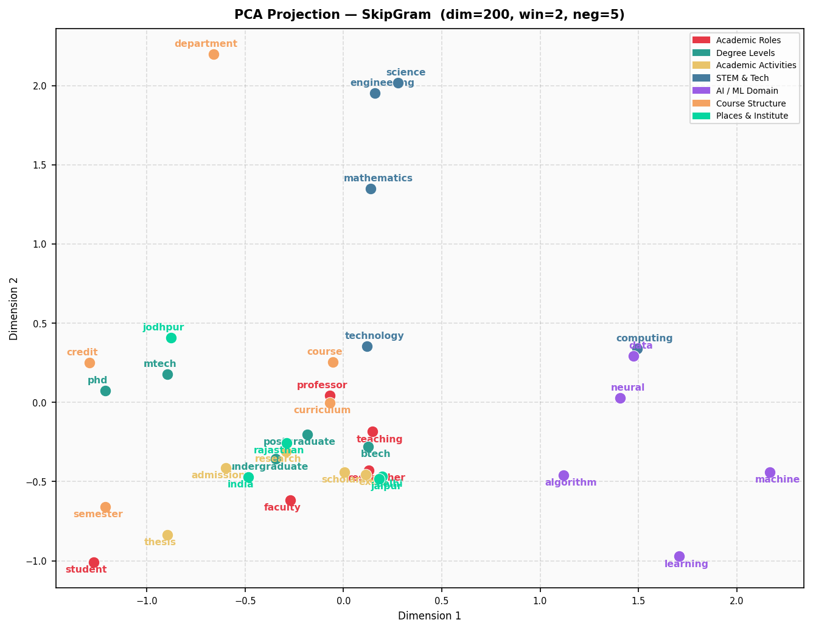 |
| t-SNE — CBOW | 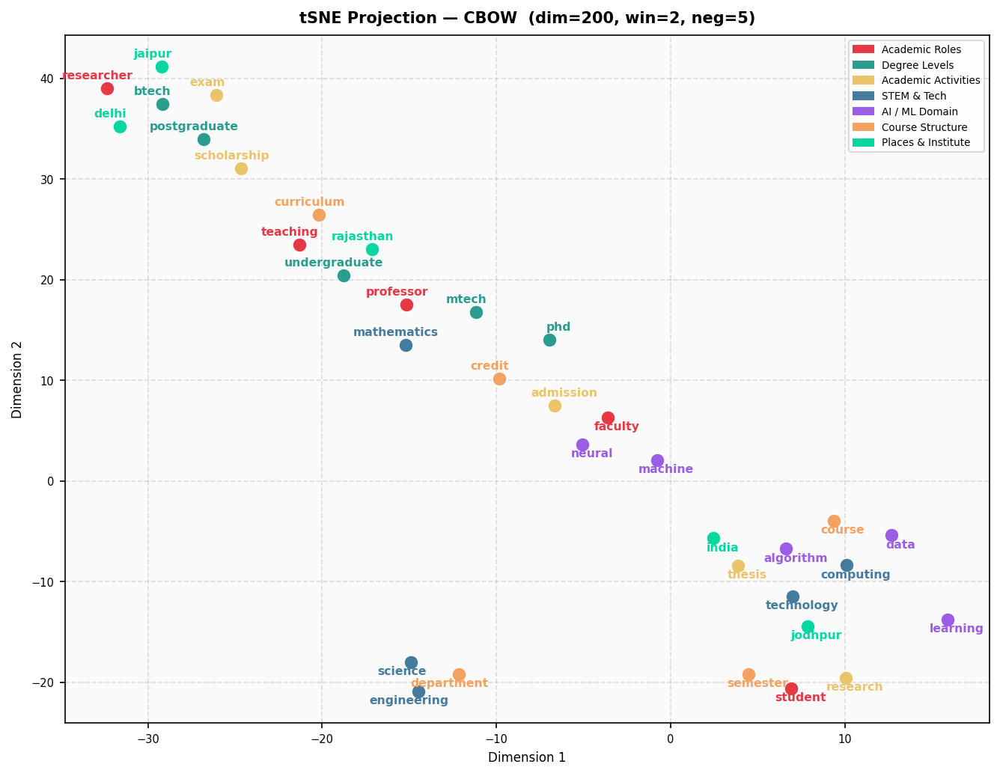 |
| t-SNE — Skip-gram | 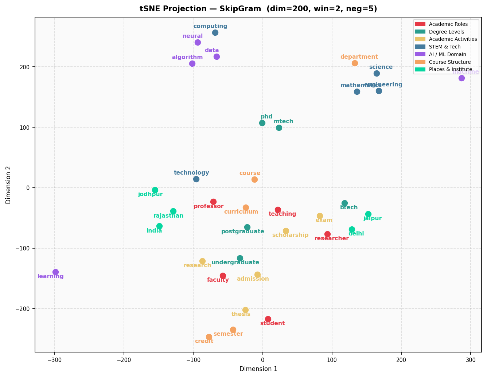 |

### Interpretation

#### PCA Observations

PCA projects the 200-dimensional embedding space onto the two directions of maximum variance. Since both models use `win=2`, context is narrow and local — the principal components tend to capture the dominant co-occurrence axes in the corpus (administrative/regulation text vs. technical/subject text).

| Observation | CBOW (win=2) | Skip-gram (win=2) |
|---|---|---|
| Overall spread | Dense central mass — vectors compressed | More spread — individual pair training adds variance |
| Degree Levels cluster | phd/mtech/btech/pg tend to sit close together | Same group separates slightly more from administrative words |
| AI/ML Domain | machine, neural, algorithm positioned near STEM cluster | Slightly more isolated — narrow pairs sharpen AI-specific context |
| Places | jodhpur, india, rajasthan may scatter peripheral | Similar scatter — geographic words share few common neighbours |
| Course Structure | semester, credit, curriculum overlap with Academic Activities | Slightly better separated — registration context is distinct |
| Cause | Averaging context vectors pulls all co-occurring word groups toward a common centroid | Individual word-context pairs preserve directional differences |

#### t-SNE Observations

t-SNE re-arranges points to preserve **local neighbourhood** distances, making it better at revealing tight semantic sub-clusters that PCA's linear projection may collapse.

| Cluster | Expected Behaviour | Explanation |
|---|---|---|
| **Degree Levels** | phd, mtech, btech, pg form a visible cluster | These labels appear in identical programme-listing contexts ("phd programme", "mtech admission", "btech curriculum") |
| **AI / ML Domain** | machine, neural, algorithm, learning group together | Co-occur densely in CSE/AI&DS syllabus sentences — narrow win=2 captures these tight pairs reliably |
| **Academic Activities** | research, thesis, scholarship overlap with Degree Levels | "phd thesis", "mtech scholarship", "research admission" — strong cross-group co-occurrence |
| **STEM & Tech** | engineering, science partially overlap with AI/ML | STEM words appear in broad course-description sentences alongside AI terms |
| **Places** | jodhpur, india, rajasthan isolated at periphery | Geographic words appear rarely and in address/contact sections — low co-occurrence with academic vocabulary |
| **Academic Roles** | professor, faculty, researcher cluster | Co-occur in faculty profile pages and programme requirement sentences |
| **Course Structure** | semester, credit, curriculum cluster | Regulation-document vocabulary — appear in highly repetitive administrative sentences |

#### CBOW vs Skip-gram — Cluster Quality Summary

| Metric | CBOW | Skip-gram |
|---|---|---|
| Avg NN similarity | **0.9979** — tight, compressed space | **0.9743** — more spread |
| PCA spread | Denser central cluster | More peripheral variance |
| t-SNE cluster separation | Groups blend more easily (high sim ≥ 0.99 for all pairs) | Slightly crisper group boundaries |
| AI/ML vs STEM distinction | Blended — both share course-description context | More distinct — win=2 pairs sharpen AI-specific bigrams (neural network, machine learning) |
| Degree level grouping | phd/mtech/btech cluster tightly | Same, but with slightly more distance from administrative words |
| Places isolation | Peripheral in both | Same — geographic scarcity overrides model architecture differences |
| Best projection for report | **PCA** — reveals dominant topic axis clearly | **t-SNE** — reveals local sub-clusters (AI/ML separation from STEM) |

#### Why Both Models Look Similar

Both CBOW and Skip-gram here use identical hyperparameters (`dim=200, win=2, neg=5`). The narrow window `win=2` means both models learn primarily from immediate neighbours — the architectural difference (averaging vs. pair-wise) is less pronounced than it would be at `win=10`. The main observable difference is that Skip-gram's lower average NN similarity (0.9743 vs 0.9979) produces a slightly more spread-out projection, making clusters easier to visually distinguish in t-SNE.

---

## File Index

```
Q1_deliverables/
├── source_code/
│   ├── scraper.py              # Task-1: web scraping (13 IITJ pages → raw_corpus.txt)
│   ├── prepare_corpus.py       # Task-1: PDF extraction + full preprocessing pipeline
│   ├── wordcloud_stats.py      # Task-1: dataset statistics + word cloud
│   ├── train_word2vec.py       # Task-2: CBOW + Skip-gram training (54 models, Gensim)
│   ├── word2vec_scratch.py     # Task-2: CBOW + Skip-gram from scratch (PyTorch + NEG)
│   ├── task2_heatmaps.py       # Task-2: hyperparameter heatmap generation
│   ├── task3_semantic.py       # Task-3: nearest neighbours + analogy experiments
│   ├── task4_visualize.py      # Task-4: PCA + t-SNE visualizations
│   └── commands.sh             # Re-run any pipeline step from scratch
├── corpus/
│   └── corpus.txt              # Cleaned, preprocessed corpus (English only)
├── visualizations/
│   ├── wordcloud.png           # Most frequent words  ← Task-1
│   ├── task2_heatmaps_combined.png  # 2×3 hyperparameter heatmap grid  ← Task-2
│   ├── task2_heatmap_cbow_neg5.png  # Individual CBOW heatmap (neg=5)
│   ├── task2_heatmap_cbow_neg10.png # Individual CBOW heatmap (neg=10)
│   ├── task2_heatmap_cbow_neg15.png # Individual CBOW heatmap (neg=15)
│   ├── task2_heatmap_skipgram_neg5.png   # Individual SG heatmap (neg=5)
│   ├── task2_heatmap_skipgram_neg10.png  # Individual SG heatmap (neg=10)
│   ├── task2_heatmap_skipgram_neg15.png  # Individual SG heatmap (neg=15)
│   ├── scratch_loss_curves.png # From-scratch training loss curves  ← Task-2.6
│   ├── task4_pca_cbow.png      # PCA projection — CBOW
│   ├── task4_pca_skipgram.png  # PCA projection — Skip-gram
│   ├── task4_tsne_cbow.png     # t-SNE projection — CBOW
│   ├── task4_tsne_skipgram.png # t-SNE projection — Skip-gram
│   └── task4_combined.png      # 2×2 comparison grid  ← Task-4
└── report/
    ├── README.md               # This file — full report with embedded figures
    ├── experiment_results.csv  # All 54 Gensim model results (Task-2)
    ├── task3_semantic_results.txt  # Full NN + analogy output (Task-3)
    └── scratch_vs_gensim_report.txt  # From-scratch vs Gensim comparison (Task-2.6)
```
